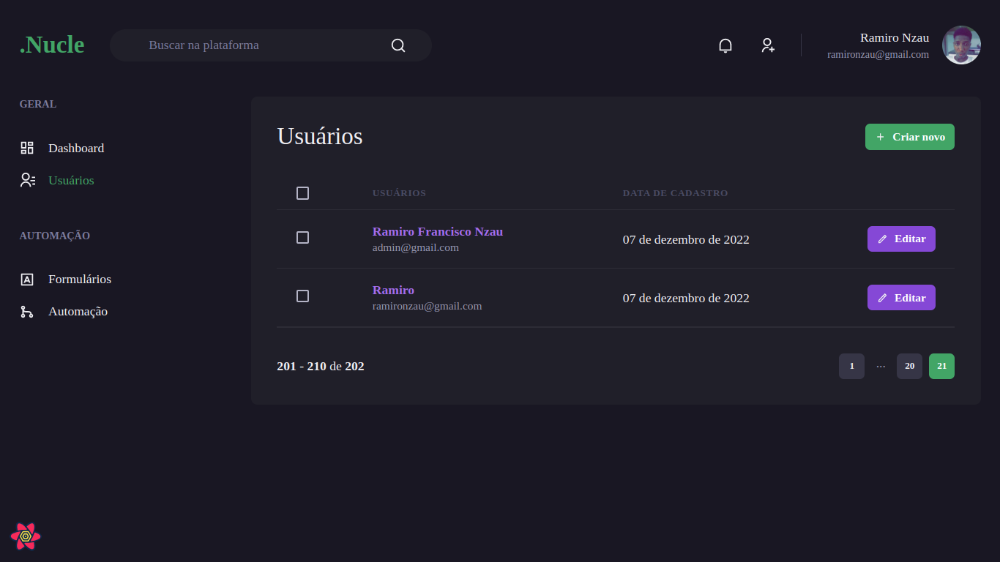

# .Nucle

## Descrição
Nucle é um dashbord desenvolvido com nextjs e chackra UI.



## Status:
 - Terminado(v1)

## Ferramentas
- Next.js
- Typescript
- chakra UI
- react-hook-form
- Miragejs
- react-quey 

## Como usar

Faça o clone deste repositório em sua máquina.

```bash
git clone https://github.com/Ramiro-Rfn/nucle.git
````

Instale as dependências rodando:
```bash
yarn 

//ou

npm install
```

Rode o progecto:

```bash
yarn dev
```

Preview Link: https://nucle.vercel.app/
